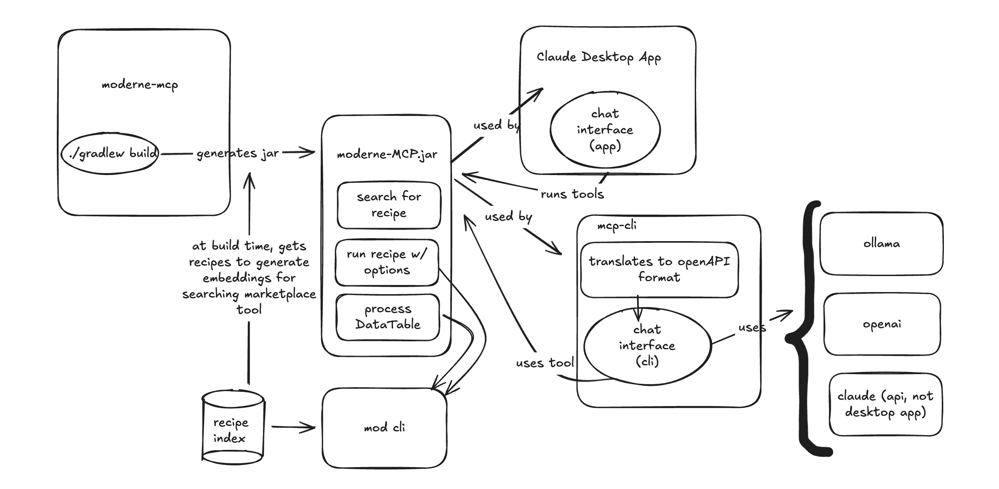

# Model Context Protocol with mod-cli for OpenAI and Ollama



# Model Context Protocol CLI
This repository contains a protocol-level CLI designed to interact with a Model Context Protocol server. The client allows users to send commands, query data, and interact with various resources provided by the server.

## Features
- Protocol-level communication with the MCP Server.
- Dynamic tool and resource exploration.
- Support for multiple providers and models:
  - Providers: OpenAI, Ollama.
  - Default models: `gpt-4o-mini` for OpenAI, `qwen2.5-coder` for Ollama.

## Prerequisites
- Python 3.8 or higher.
- Required dependencies (see [Installation](#installation))
- If using ollama you should have ollama installed and running.
- If using openai you should have an api key set in your environment variables (OPENAI_API_KEY=yourkey)

## Installation
1. Clone the repository:

```bash
git clone https://github.com/moderneinc/mcp-cli
cd mcp-cli
```

2. Install UV:

```bash
pip install uv
```

3. Resynchronize dependencies:

```bash
uv sync --reinstall
```

4. Build MCP jar:

Follow the instructions here: https://github.com/moderneinc/moderne-mcp.

Then update the path to the jar in the `server_config.json` file in project root.

## Usage
To start the client and interact with the SQLite server, run the following command:

```bash
uv run mcp-cli --server moderne
```

### Command-line Arguments
- `--server`: Specifies the server configuration to use. Required.
- `--config-file`: (Optional) Path to the JSON configuration file. Defaults to `server_config.json`.
  - `--all`: (Optional) Use all the servers provided in the config
- `--provider`: (Optional) Specifies the provider to use (`openai` or `ollama`). Defaults to `openai`.
- `--model`: (Optional) Specifies the model to use. Defaults depend on the provider:
  - `gpt-4o-mini` for OpenAI.
  - `llama3.2` for Ollama.

### Examples
Run the client with the default OpenAI provider and model:

```bash
uv run mcp-cli --server moderne
```

Run the client with a specific configuration and Ollama provider:

```bash
uv run mcp-cli --server moderne --provider ollama --model llama3.2
```

Run the client with the default OpenAI provider and model, with all the servers in the config provided:

```bash
uv run mcp-cli --config "path to your server_config.json" --all
```

## Interactive Mode
The client supports interactive mode, allowing you to execute commands dynamically. Type `help` for a list of available commands or `quit` to exit the program.

## Supported Commands
- `ping`: Check if the server is responsive.
- `list-tools`: Display available tools.
- `list-resources`: Display available resources.
- `list-prompts`: Display available prompts.
- `chat`: Enter interactive chat mode.
- `clear`: Clear the terminal screen.
- `help`: Show a list of supported commands.
- `quit`/`exit`: Exit the client.

### Chat Mode
To enter chat mode and interact with the server:

`uv run mcp-cli --server moderne`

In chat mode, you can use tools and query the server interactively. The provider and model used are specified during startup and displayed as follows:

Entering chat mode using provider 'ollama' and model 'llama3.2'...

#### Using OpenAI Provider:
If you wish to use openai models, you should

- set the `OPENAI_API_KEY` environment variable before running the client, either in .env or as an environment variable.

## Contributing
Contributions are welcome! Please open an issue or submit a pull request with your proposed changes.

## License
This project is licensed under the [MIT License](license.md).
